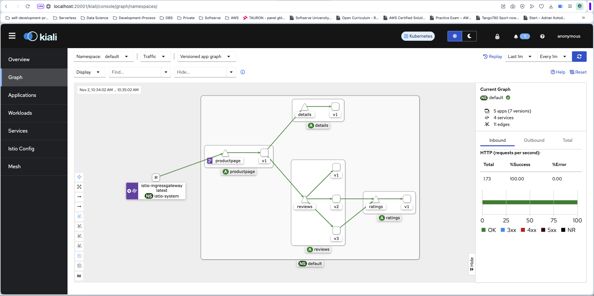

# Goal 

This repo you can use to setup [AWS EKS cluster](https://aws.amazon.com/eks/) with [Istio](https://istio.io) and sample [Bookinfo microservices app](https://istio.io/latest/docs/examples/bookinfo/), [Kiali addon](https://istio.io/latest/docs/tasks/observability/kiali/) for visualizing your Mesh and other observability tools. 

# Prereqisities

- **AWS CLI** installed and configured
- **eksctl CLI** installed
- **kubectl CLI** installed
- **istioctl CLI** installed 
- AWS_REGION and CLUSTER_NAME environment variables configured 

# Deployment

After cloning this repository please execute:

setup variables

```bash
export CLUSTER_NAME='my-cluster'
export AWS_REGION='us-west-1'
```

bootstrap cluster creating
```sh
cd ~/aws-istio-lab
git clone https://github.com/istio/istio.git
cd infrastructure
bash bootstrap.sh
```
It should take a while.

# Verification

## Istio components
```bash
kubectl get all -n istio-system
```

## Bookinfo app components
```bash
kubectl get all -n default
```

## Application load simulation

```bash
~/aws-istio-lab
bash tests/load.sh
```

## Verify kiali dashboard

```bash
istioctl dashboard kiali
```

Should looks like this



# Congratulations

Mission complete!

# Destroy

Destroy resources for reducing the carbon footprint and save money!

```bash
eksctl delete ng nodegroup --cluster=eks --drain=false
eksctl delete cluster -f eks.yaml
```

# Credits

[SoftServe](https://www.softserveinc.com/en-us)

[A Cloud Guru platform](https://www.pluralsight.com/cloud-guru)

[EKS Workshop](https://www.eksworkshop.com)